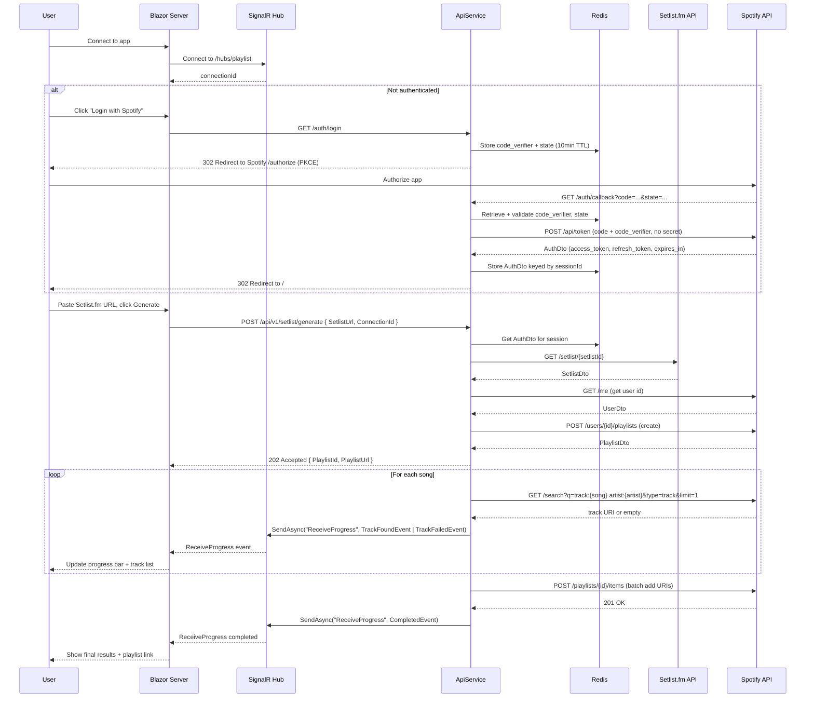

# Technical Specification — SetlistToPlaylist

## Overview

Purpose: Convert a `Setlist.fm` setlist page into a Spotify playlist for an authenticated Spotify user.

High-level flow: Blazor Server frontend accepts a `Setlist.fm` URL → user clicks "Generate" → API validates URL and extracts setlist id → Setlist.fm module fetches setlist → Spotify PKCE OAuth is ensured → playlist is created → tracks are searched and added → real-time progress is streamed back to the UI via SignalR.

This is a single-action flow: one button click drives the entire pipeline end to end. There is no separate preview or populate step.

Runtime projects:

| Project | Role |
|---|---|
| `SetlistToPlaylist.AppHost` | Aspire AppHost — composes all services, wires Redis, health checks |
| `SetlistToPlaylist.ApiService` | ASP.NET Core Web API — MVC controllers, SignalR hub, auth endpoints |
| `SetlistToPlaylist.Web` | Blazor Server frontend — Interactive Server Components |
| `SetlistToPlaylist.ServiceDefaults` | Shared DI helpers, OpenTelemetry, resilience |
| `SetlistToPlaylist.Backend.Modules.SetlistFm` | Setlist.fm typed HTTP client and implementation |
| `SetlistToPlaylist.Backend.Modules.SetlistFm.Abstractions` | Setlist.fm DTOs and service/client interfaces |
| `SetlistToPlaylist.Backend.Modules.Spotify` | Spotify typed HTTP clients and implementation |
| `SetlistToPlaylist.Backend.Modules.Spotify.Abstractions` | Spotify DTOs and service/client interfaces |

---

## Decisions

| Decision | Choice | Reason |
|---|---|---|
| Blazor rendering mode | Interactive Server Components (Blazor Server) | Simpler hosting, server-side state, no CORS complexity |
| Spotify OAuth | PKCE (Proof Key for Code Exchange) | No client secret required, suitable for personal use |
| Token storage | Server-side Redis (`IDistributedCache`), keyed by session | Tokens never travel in request/response bodies |
| API style | MVC Controllers | Existing scaffold; no refactor needed |
| Progress updates | SignalR hub (`/hubs/playlist`) | Real-time per-track feedback during playlist population |
| UX flow | Single action | One "Generate" button drives the full pipeline |

---

## Actors

- End user (owns a Spotify account; uses the Blazor UI)
- Blazor Server frontend (server-rendered; code runs on the server)
- ApiService (HTTP API surface, SignalR hub, OAuth callback handler)
- External services:
  - Setlist.fm API (retrieve setlist JSON)
  - Spotify Accounts API (OAuth token exchange)
  - Spotify Web API (search, playlists, user profile)

---

## Architecture

### AppHost (`src/AppHost/AppHost.cs`)

```csharp
var builder = DistributedApplication.CreateBuilder(args);

var cache = builder.AddRedis("cache");

var apiService = builder.AddProject<Projects.SetlistToPlaylist_ApiService>("apiservice")
    .WithReference(cache)
    .WaitFor(cache)
    .WithHttpsEndpoint(port: 5001, name: "https")   // fixed port required for Spotify OAuth redirect URI
    .WithHttpHealthCheck("/health");

builder.AddProject<Projects.SetlistToPlaylist_Web>("webfrontend")
    .WithExternalHttpEndpoints()
    .WithHttpHealthCheck("/health")
    .WithReference(cache)
    .WaitFor(cache)
    .WithReference(apiService)
    .WaitFor(apiService);

builder.Build().Run();
```

### ApiService (`src/Backend/Api/Program.cs`)

Registers:
- `builder.AddServiceDefaults()`
- `builder.AddRedisDistributedCache("cache")` — token store
- `builder.Services.AddSession()` with secure, SameSite=Strict cookie options
- `builder.Services.AddControllers()` with JSON options (System.Text.Json camelCase)
- `builder.Services.AddSignalR()`
- `builder.Services.AddOpenApi()` (dev only)
- All module services: `ISetlistFmService`, `ISpotifyAuthClient`, `ISpotifyApiClient`, `ISpotifyService`
- `builder.Services.AddCors()` — allow Blazor frontend origin
- `app.UseSession()`
- `app.MapControllers()`
- `app.MapHub<PlaylistProgressHub>("/hubs/playlist")`
- `app.MapDefaultEndpoints()`

### Blazor Web (`src/Frontend/Web/Program.cs`)

Registers:
- `builder.AddServiceDefaults()`
- `builder.AddRedisOutputCache("cache")`
- `builder.Services.AddRazorComponents().AddInteractiveServerComponents()`
- `builder.Services.AddHttpClient<SetlistToPlaylistApiClient>(...)` — typed client using Aspire service discovery (`https+http://apiservice`)
- `app.MapRazorComponents<App>().AddInteractiveServerRenderMode()`
- `app.MapDefaultEndpoints()`

---

## Data flow (single action)

1. User pastes a `Setlist.fm` URL and clicks "Generate".
2. Blazor component connects to SignalR hub `/hubs/playlist` and captures `connectionId`.
3. Blazor posts `GeneratePlaylistRequest` (`SetlistUrl`, `ConnectionId`) to `POST /api/v1/setlist/generate`.
4. API checks for a valid Spotify token in session/Redis.
   - If no token: return `401` with `{ RedirectTo: "/auth/login" }`.
   - Blazor navigates the user to `/auth/login` (full-page redirect).
5. API extracts setlist id from URL (validates format, prevents SSRF).
6. API calls `ISetlistFmService.GetSetlistAsync(url)`.
7. API calls `ISpotifyApiClient.GetCurrentUserIdAsync()`.
8. API calls `ISpotifyApiClient.CreatePlaylistAsync(userId, name, description, isPublic: false)`.
9. API returns `202 Accepted` with `{ PlaylistId, PlaylistUrl }` immediately.
10. API enqueues a `PopulatePlaylistJob` onto `IBackgroundTaskQueue` and returns. A `BackgroundService` (`PlaylistPopulationWorker`) dequeues and processes it:
    a. For each song in `setlist.Sets.Set[*].Song`:
       - Calls `ISpotifyApiClient.SearchTrackAsync(songName, artistName)`.
       - Pushes `TrackFoundEvent` or `TrackFailedEvent` to SignalR `connectionId`.
    b. Batches found track URIs (up to 100 per request) and calls `ISpotifyApiClient.AddTracksToPlaylistAsync(playlistId, uris)`.
    c. Pushes `CompletedEvent` with final `PlaylistDto`, `TrackUris[]`, `FailedTracks[]` to SignalR `connectionId`.
11. Blazor updates UI incrementally as SignalR events arrive.

---

## API contract

### POST `/api/v1/setlist/generate`

**Controller:** `SetlistToPlaylistController`

**Request body — `GeneratePlaylistRequest`:**
```csharp
public sealed record GeneratePlaylistRequest
{
    public required string SetlistUrl { get; init; }
    public required string ConnectionId { get; init; }   // SignalR connection id
    public bool IsPublic { get; init; } = false;
}
```

> `SpotifyAuth` is NOT part of the request. Tokens are retrieved from server-side session.

**Success response — `202 Accepted` — `GeneratePlaylistStartedResponse`:**
```csharp
public sealed record GeneratePlaylistStartedResponse
{
    public required string PlaylistId { get; init; }
    public required string PlaylistUrl { get; init; }
}
```

**Error responses:**
- `400 Bad Request` — invalid or missing `SetlistUrl` or `ConnectionId`
- `401 Unauthorized` — `{ "redirectTo": "/auth/login" }`
- `502 Bad Gateway` — Setlist.fm or Spotify upstream failure

---

### Auth endpoints (`AuthController`)

> Auth endpoints use the path prefix `/auth` (not `/api/v1/auth`) to match the Spotify redirect URI registered in the developer portal: `https://127.0.0.1:5001/auth/callback`.

#### GET `/auth/login`

Generates PKCE `code_verifier` (random 64-byte base64url string) and `code_challenge` (SHA256 hash of verifier, base64url encoded). Stores `code_verifier` and a random `state` in server session. Redirects browser to Spotify authorization URL:

```
https://accounts.spotify.com/authorize
  ?client_id={Spotify:ClientId}
  &response_type=code
  &redirect_uri={Spotify:CallbackUrl}
  &code_challenge_method=S256
  &code_challenge={code_challenge}
  &state={state}
  &scope=playlist-modify-private%20playlist-modify-public%20user-read-private
```

No `client_secret` is sent or required for PKCE.

#### GET `/auth/callback`

Query params: `code`, `state`.

1. Validates `state` matches session value (CSRF protection).
2. Retrieves `code_verifier` from session.
3. Calls `ISpotifyAuthClient.ExchangeCodeAsync(code, codeVerifier)` — POST to `https://accounts.spotify.com/api/token` with:
   ```
   grant_type=authorization_code
   &code={code}
   &redirect_uri={Spotify:CallbackUrl}
   &client_id={Spotify:ClientId}
   &code_verifier={code_verifier}
   ```
4. Stores resulting `AuthDto` (access token, refresh token, expiry) in Redis keyed by session id.
5. Redirects browser back to Blazor frontend root `/`.

---

## SignalR hub

**Hub:** `PlaylistProgressHub` at `/hubs/playlist`

The hub is used server-to-client only for this flow. The client connects on page load, captures its `connectionId` and passes it with the generate request. The API background task uses `IHubContext<PlaylistProgressHub>` to push events to the specific `connectionId`.

**Progress event model:**
```csharp
public sealed record PlaylistProgressEvent
{
    public required string Type { get; init; }
    // Type values: "track_found" | "track_failed" | "completed" | "error"

    public string? SongName { get; init; }
    public string? TrackUri { get; init; }
    public int Current { get; init; }
    public int Total { get; init; }

    // Populated on "completed"
    public PlaylistDto? Playlist { get; init; }
    public string[]? TrackUris { get; init; }
    public string[]? FailedTracks { get; init; }

    // Populated on "error"
    public string? ErrorMessage { get; init; }
}
```

**Hub method the server calls on clients:**
```csharp
Task ReceiveProgress(PlaylistProgressEvent progressEvent);
```

**Blazor component connects via:**
```csharp
var connection = new HubConnectionBuilder()
    .WithUrl(Navigation.ToAbsoluteUri("/hubs/playlist"))
    .Build();

connection.On<PlaylistProgressEvent>("ReceiveProgress", OnProgress);
await connection.StartAsync();
var connectionId = connection.ConnectionId;
```

---

## Data models

### Setlist.fm DTOs (`SetlistToPlaylist.Backend.Modules.SetlistFm.Abstractions/DTOs`)

Mirror the Setlist.fm API JSON response exactly. Required properties marked with `required` keyword.

```
SetlistDto
  string Id
  string EventDate          // "dd-MM-yyyy" format from API
  ArtistDto Artist
    string Mbid
    string Name
    string SortName
    string Url
  VenueDto Venue
    string Id
    string Name
    string Url
    CityDto City
      string Id
      string Name
      string StateCode
      string State
      CountryDto Country
        string Code
        string Name
      CoordsDto Coords
        decimal Lat
        decimal Long
  TourDto? Tour
    string Name
  SetsDto Sets
    SetDto[] Set
      int? Encore
      SongDto[] Song
        string Name
        string? Info
        bool? Tape
  string Url              // the setlist.fm URL for this setlist
```

### Spotify DTOs (`SetlistToPlaylist.Backend.Modules.Spotify.Abstractions/DTOs`)

```
AuthDto
  string AccessToken
  string RefreshToken
  DateTime ExpiresAtUtc
  string Scope

PlaylistDto
  string PlaylistId
  string PlaylistName
  string? PlaylistDescription
  ExternalUrlsDto ExternalUrls
    string Spotify

UserDto
  string Id
  string DisplayName

TrackItemDto
  string Uri
  string Name
  ArtistDto[] Artists
    string Name

TracksDto
  TrackItemDto[] Items
```

### API contracts (`src/Backend/Api/Contracts`)

```
GeneratePlaylistRequest          { SetlistUrl, ConnectionId, IsPublic }
GeneratePlaylistStartedResponse  { PlaylistId, PlaylistUrl }
PlaylistProgressEvent            (see SignalR section above)
AuthCallbackResponse             { Success, RedirectTo }
```

> Remove `PopulatePlaylistRequest` and `PopulatePlaylistResponse` — population is handled internally by the generate pipeline. Remove `AuthRequest` from all request contracts — tokens are never passed by clients.

---

## Authentication & Authorization (Spotify PKCE)

Flow summary:
1. Client hits `GET /auth/login`.
2. Server generates `code_verifier` (cryptographically random, 43–128 chars, base64url), derives `code_challenge = BASE64URL(SHA256(ASCII(code_verifier)))`.
3. Server stores `{ code_verifier, state }` in `IDistributedCache` keyed by session id, TTL 10 minutes.
4. Server redirects to Spotify authorization URL (see above).
5. User authorizes in browser. Spotify redirects to `GET /auth/callback?code=...&state=...`.
6. Server validates `state`, retrieves `code_verifier` from cache, calls Spotify token endpoint (no `client_secret`).
7. Server stores `AuthDto` in `IDistributedCache` keyed by session id, TTL = token expiry - 5 minutes.
8. Server redirects to `/`.

Token refresh:
- Before each Spotify API call, `ISpotifyApiClient` checks if `AuthDto.ExpiresAtUtc < DateTime.UtcNow + 1 minute`.
- If so, calls `ISpotifyAuthClient.RefreshTokenAsync(authDto)` and stores updated `AuthDto` back to Redis.

Session key convention: `spotify_auth:{sessionId}`
PKCE state key convention: `pkce_state:{sessionId}`

Required Spotify scopes:
- `playlist-modify-private`
- `playlist-modify-public`
- `user-read-private`

---

## Module interfaces

### `ISetlistFmService` (`SetlistFm.Abstractions/Services`)

```csharp
public interface ISetlistFmService
{
    Task<Result<SetlistDto>> GetSetlistAsync(string setlistFmUrl, CancellationToken ct = default);
}
```

Implementation calls `ISetlistFmClient` which is a typed `HttpClient` registered with Polly resilience.

### `ISetlistFmClient` (`SetlistFm.Abstractions/Clients`)

```csharp
public interface ISetlistFmClient
{
    Task<Result<SetlistDto>> GetSetlistByIdAsync(string setlistId, CancellationToken ct = default);
}
```

URL extraction from setlist.fm URL: `Regex.Match(url, @"/setlist/[^/]+/[^/]+-([a-f0-9]+)\.html")` — capture group 1 is the setlist id.

### `ISpotifyAuthClient` (`Spotify.Abstractions/Clients`)

```csharp
public interface ISpotifyAuthClient
{
    Task<Result<AuthDto>> ExchangeCodeAsync(string code, string codeVerifier, CancellationToken ct = default);
    Task<Result<AuthDto>> RefreshTokenAsync(string refreshToken, CancellationToken ct = default);
}
```

> Remove `CreateOAuthRequestUrl` and `AddStateToOAuthRequestUrl` from this interface — PKCE URL construction belongs in `AuthController` directly.

### `ISpotifyApiClient` (`Spotify.Abstractions/Clients`)

```csharp
public interface ISpotifyApiClient
{
    Task<Result<UserDto>> GetCurrentUserAsync(string accessToken, CancellationToken ct = default);
    Task<Result<PlaylistDto>> CreatePlaylistAsync(string userId, string name, string description, bool isPublic, string accessToken, CancellationToken ct = default);
    Task<Result<string?>> SearchTrackAsync(string songName, string artistName, string accessToken, CancellationToken ct = default);
    // Uses POST /playlists/{playlist_id}/items (not the deprecated /tracks endpoint)
    Task<Result> AddTracksToPlaylistAsync(string playlistId, IEnumerable<string> trackUris, string accessToken, CancellationToken ct = default);
}
```

`SearchTrackAsync` returns the track URI string on success, `null` if no match found (not an error), or a `Fail` result for API errors.

### `ISpotifyService` (`Spotify.Abstractions/Services`)

Orchestration layer used by the controller and the background worker. Retrieves and refreshes tokens internally.

```csharp
public interface ISpotifyService
{
    Task<Result<string>> GetCurrentUserIdAsync(string sessionId, CancellationToken ct = default);
    Task<Result<PlaylistDto>> CreatePlaylistAsync(string userId, SetlistDto setlist, bool isPublic, string sessionId, CancellationToken ct = default);
    Task PopulatePlaylistAsync(string playlistId, SetlistDto setlist, string artistName, string sessionId, string signalRConnectionId, CancellationToken ct = default);
}
```

`PopulatePlaylistAsync` is called by `PlaylistPopulationWorker` (the background service). It searches tracks, pushes SignalR progress events per track via `IHubContext<PlaylistProgressHub>`, batches adds, and pushes a final `completed` event.

### Background task queue

```csharp
// Job model
public sealed record PopulatePlaylistJob(
    string PlaylistId,
    SetlistDto Setlist,
    string ArtistName,
    string SessionId,
    string SignalRConnectionId
);

// Queue abstraction
public interface IBackgroundTaskQueue
{
    ValueTask EnqueueAsync(PopulatePlaylistJob job, CancellationToken ct = default);
    ValueTask<PopulatePlaylistJob> DequeueAsync(CancellationToken ct);
}

// Implementation: Channel<PopulatePlaylistJob>-backed queue
// Registered as singleton: services.AddSingleton<IBackgroundTaskQueue, BackgroundTaskQueue>()

// Worker
// PlaylistPopulationWorker : BackgroundService
// Registered as: services.AddHostedService<PlaylistPopulationWorker>()
// Dequeues jobs, creates a DI scope, resolves ISpotifyService, calls PopulatePlaylistAsync
```

---

## Spotify playlist creation rules

- **Name:** `{Artist.Name} @ {Venue.Name} — {dd MMM yyyy}` (e.g. `Radiohead @ Roundhouse — 15 Jun 2016`)
- **Description:** `Live at {Venue.Name}, {Venue.City.Name} on {dd-MM-yyyy}. Setlist: {setlist.Url}`
- **Privacy:** `isPublic = false` by default; `GeneratePlaylistRequest.IsPublic` overrides.

---

## Track resolution

For each `Song` in `setlist.Sets.Set[*].Song` where `Song.Tape != true`:

1. Normalize song name: strip `(live)`, `(reprise)`, `feat. ...`, leading/trailing whitespace, and collapse multiple spaces.
2. Query: `track:{normalizedName} artist:{artist.Name}` with `type=track&limit=1`.
3. If result found: take `tracks.items[0].uri`.
4. If no result: retry with `track:{normalizedName}` only (no artist filter).
5. If still no result: add `Song.Name` (un-normalized) to `FailedTracks`.

Skip songs where `Song.Tape == true` (backing tracks — do not add to playlist).

---

## Playlist population (background task detail)

`ISpotifyService.RunPopulateAsync` internal steps:

1. Collect all non-tape songs from setlist.
2. For each song (index `i` of `total`):
   a. Call `ISpotifyApiClient.SearchTrackAsync`.
   b. If found: add URI to `foundUris` list. Push `{ Type="track_found", SongName, TrackUri, Current=i+1, Total=total }` via `IHubContext<PlaylistProgressHub>.Clients.Client(connectionId).SendAsync("ReceiveProgress", ...)`.
   c. If not found: push `{ Type="track_failed", SongName, Current=i+1, Total=total }`.
3. Batch `foundUris` into groups of 100. Call `ISpotifyApiClient.AddTracksToPlaylistAsync` per batch.
4. Push final event: `{ Type="completed", Playlist, TrackUris=foundUris, FailedTracks }`.
5. On any unhandled exception: push `{ Type="error", ErrorMessage }`.

---

## Rate limits, retries, and error handling

Register Polly policies per HTTP client in `ServiceDefaults` or module DI registration:

| Client | Policy |
|---|---|
| `ISetlistFmClient` | Retry 3× with exponential backoff for 5xx |
| `ISpotifyApiClient` | Retry 3× exponential backoff for 5xx; Wait-and-retry honoring `Retry-After` for 429; Circuit-breaker (5 failures / 30s window) |
| `ISpotifyAuthClient` | Retry 2× for 5xx only |

All HTTP calls accept `CancellationToken`. Controller passes `HttpContext.RequestAborted`.

Translate `Result.IsFailed` into HTTP responses at controller boundaries:
- Setlist.fm 404 → `404 Not Found` with `{ error: "Setlist not found" }`
- Spotify 401 → attempt token refresh once, then return `401` to client
- Upstream 5xx → `502 Bad Gateway`
- Validation failure → `400 Bad Request`

---

## Logging and telemetry

- Use `ILogger<T>` in all controllers and services.
- Structured logging format: `_logger.LogInformation("Found track {TrackUri} for song {SongName}", uri, song.Name)`.
- Add correlation id middleware: generate/forward `X-Correlation-Id` header; include in all log entries.
- OpenTelemetry is registered in `ServiceDefaults` — traces and metrics are exported via OTLP.
- Aspire Dashboard automatically collects telemetry from all services when running via AppHost.

---

## Security considerations

- Spotify tokens stored in `IDistributedCache` (Redis) server-side only. Never returned to client in any API response.
- PKCE `code_verifier` stored in `IDistributedCache` with 10-minute TTL. Deleted after successful exchange.
- Validate OAuth `state` parameter on callback to prevent CSRF.
- Validate and sanitize `SetlistUrl` input: must be an absolute URI with host `www.setlist.fm`. Reject any other host.
- Enforce HTTPS redirection in non-development environments.
- Session cookies: `Secure=true`, `HttpOnly=true`, `SameSite=Strict`.
- Use `dotnet user-secrets` for local dev secrets. Never commit `appsettings` files containing secrets.
- Restrict Spotify OAuth redirect URI to the configured `Spotify:CallbackUrl` value only.

---

## Configuration keys

Provide via `appsettings.json`, `appsettings.{Environment}.json`, environment variables or `dotnet user-secrets`.

```
Spotify:ClientId              — Spotify app client id (required; set via dotnet user-secrets)
Spotify:CallbackUrl           — Full OAuth redirect URI: https://127.0.0.1:5001/auth/callback (local dev)

SetlistFm:ApiKey              — Setlist.fm API key (required; set via dotnet user-secrets)
SetlistFm:BaseUrl             — https://api.setlist.fm/rest/1.0

ConnectionStrings:cache       — Redis connection string (injected by Aspire automatically in development)
```

No `Spotify:ClientSecret` is required or used (PKCE flow).

User secrets are set on the ApiService project:
```bash
dotnet user-secrets set "Spotify:ClientId" "<your-client-id>" --project src/Backend/Api
dotnet user-secrets set "SetlistFm:ApiKey" "<your-api-key>" --project src/Backend/Api
```

The ApiService csproj must include a `<UserSecretsId>` to enable `dotnet user-secrets`.

DI registrations in `ApiService/Program.cs`:
```csharp
builder.Services.AddHttpClient<ISetlistFmClient, SetlistFmClient>()
    .AddStandardResilienceHandler();

builder.Services.AddHttpClient<ISpotifyApiClient, SpotifyApiClient>()
    .AddStandardResilienceHandler();

builder.Services.AddHttpClient<ISpotifyAuthClient, SpotifyAuthClient>();

builder.Services.AddScoped<ISetlistFmService, SetlistFmService>();
builder.Services.AddScoped<ISpotifyService, SpotifyService>();

builder.Services.AddSingleton<IBackgroundTaskQueue, BackgroundTaskQueue>();
builder.Services.AddHostedService<PlaylistPopulationWorker>();
```

---

## Frontend (Blazor Server) behavior and UX

### Pages / Components

| Component | Path | Purpose |
|---|---|---|
| `Home.razor` | `/` | Main page — URL input form, progress panel, results panel |
| `AuthCallback.razor` | N/A | Not needed — callback is handled by `AuthController` |

### Home page flow

1. On initialize: establish SignalR connection to `/hubs/playlist`. Store `connectionId`.
2. If no active session token (check via `GET /api/v1/auth/status`): show "Login with Spotify" button that navigates to `/auth/login` (full-page navigation — triggers the PKCE redirect).
3. Show URL input form and "Generate Playlist" button (disabled until auth confirmed and URL entered).
4. On submit:
   a. POST `GeneratePlaylistRequest` to `/api/v1/setlist/generate`.
   b. If `401`: navigate to `/auth/login`.
   c. On `202`: store `PlaylistId` and `PlaylistUrl`. Show progress panel with playlist link.
5. Progress panel updates in real time as SignalR `ReceiveProgress` events arrive:
   - Show progress bar: `{Current} / {Total} tracks processed`.
   - Stream list of found tracks (green) and failed tracks (amber) as they arrive.
6. On `completed` event: show final summary — playlist link, track count, failed tracks list with download/copy option.
7. On `error` event: show error message. Allow user to retry.

### Auth status check

`GET /api/v1/auth/status` — returns `200 { authenticated: true }` or `200 { authenticated: false }`. Does not return tokens. Used by the Blazor component to conditionally show the login button.

---

## Sequence diagram (happy path)



---

## Verification / manual steps

### Local run

```bash
# Store secrets (on the ApiService project, never the AppHost)
dotnet user-secrets set "Spotify:ClientId" "<your-client-id>" --project src/Backend/Api
dotnet user-secrets set "SetlistFm:ApiKey" "<your-api-key>" --project src/Backend/Api

# Build and run via Aspire
dotnet run --project src/AppHost
```

Aspire dashboard opens automatically. Redis, ApiService, and WebFrontend are all started and health-checked.

### Test scenarios

| Scenario | Expected |
|---|---|
| Happy path | Paste known setlist URL, complete OAuth, see progress updates, playlist created |
| Unauthenticated | Generate without login → redirect to Spotify → resume → playlist created |
| Invalid URL | Non-setlist.fm URL or malformed → 400 with clear error |
| No tracks found | All songs in FailedTracks, empty playlist created |
| Spotify 429 | Polly honors Retry-After, no crash, progress resumes |
| Token expired mid-run | Auto-refresh, population continues transparently |

---

## CI/CD and observability (recommended additions)

- GitHub Actions: build → test → publish on push to `main`.
- Secrets via repository secrets (`SPOTIFY_CLIENT_ID`, `SETLIST_FM_API_KEY`).
- Health check endpoints `/health` on both ApiService and Web (already wired by `MapDefaultEndpoints()`).
- Aspire Dashboard provides traces, logs, and metrics in local development with no additional setup.

---

## Notes on repository conventions

- File location of this document: `src/Docs/SetlistToPlaylist_TechnicalSpecificationDocument.md`
- All projects target `net10.0`.
- `TreatWarningsAsErrors = true` in all projects.
- Nullable reference types enabled everywhere.
- Use `System.Text.Json` throughout. Do not introduce Newtonsoft.Json.
- Use `FluentResults` (`Result<T>`) for service and client return types. Do not throw exceptions across service boundaries.
- Use `FluentValidation` for request model validation in controllers.
- Prefer `sealed record` for DTOs and request/response contracts.
