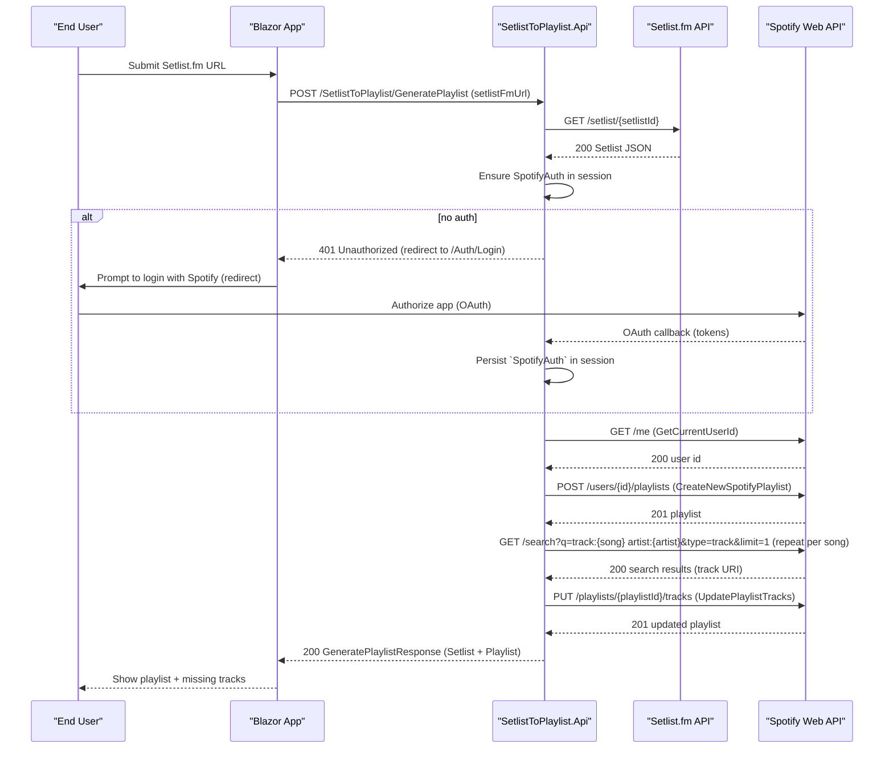

# Technical specification — SetlistToPlaylist

## Overview

Purpose: Convert a `Setlist.fm` setlist page into a Spotify playlist for an authenticated Spotify user.

High-level flow: Blazor frontend accepts a `Setlist.fm` URL ? Backend extracts setlist id and fetches setlist JSON ? Backend ensures Spotify OAuth tokens ? Backend creates empty playlist ? Backend resolves each setlist song to a Spotify track via search ? Backend populates the playlist with found track URIs ? Frontend displays results and any missing tracks.

Related code references: `Program.cs`, `SetlistToPlaylistController`, `PlayListBuilder`, `ISpotifyApiClient`, `ISetlistFmApiClient`, `ISpotifyAuthClient`, `IAuthTokenFetcher`.

---

## Actors

- End user (owns a Spotify account; uses the Blazor UI)
- Blazor frontend (client-side UI)
- ASP.NET Core backend API (`SetlistToPlaylist.Api`)
- External services:
  - `Setlist.fm` API (retrieve setlist JSON)
  - Spotify Web API (OAuth, search, playlists)

---

## Architecture (components)

- Frontend: Blazor WebAssembly or Server app (single page receives URL and drives flows)
- Backend: ASP.NET Core 8 API
  - Controllers: `SetlistToPlaylistController`, `AuthController`
  - Services: `PlayListBuilder` (business logic)
  - RestApiClients: `ISetlistFmApiClient`, `ISpotifyApiClient`, `ISpotifyAuthClient`
  - Session/token fetcher: `IAuthTokenFetcher` (stores/retrieves `SpotifyAuth` in session)
- Configuration files: `ApiSecrets.json`, `appsettings.json` and `ApiClientSettings`

Keep separation: Controller -> Service -> RestApiClient.

---

## Data flow

1. User posts a `Setlist.fm` URL from the Blazor UI.
2. Backend extracts the setlist id from the URL.
3. Backend calls `Setlist.fm` API to retrieve setlist JSON (via `ISetlistFmApiClient`).
4. Backend ensures an active Spotify auth token (redirect to OAuth flow if missing) via `IAuthTokenFetcher` and `ISpotifyAuthClient`.
5. Backend calls Spotify API:
   - `GetCurrentUserIdAsync` to get the Spotify user id
   - `CreateNewSpotifyPlaylistAsync` to create an empty playlist (title & description derived from setlist metadata)
   - For each song, query Spotify `search` endpoint to find a matching track ? collect track URIs
   - `UpdatePlaylistTracksAsync` to set playlist tracks
6. Backend returns a result object to the frontend with playlist details, found track URIs, and failed tracks.

---

## API contract (endpoints)

- POST `/SetlistToPlaylist/GeneratePlaylist`
  - Request body: raw string (the `Setlist.fm` URL)
  - Behavior: extracts setlist id ? fetch setlist ? ensure Spotify auth ? create playlist
  - Response (200): JSON-serialized `GeneratePlaylistResponse`:
    - `Setlist` (full setlist JSON as returned by `Setlist.fm`)
    - `Playlist` (`SpotifyPlaylist` with `id`, `name`, `description`, etc.)
  - Errors:
    - 400 Bad Request for invalid/missing URL
    - 401 Unauthorized if user not authenticated and OAuth flow fails
    - 502/503 for upstream API failures

- POST `/SetlistToPlaylist/PopulatePlaylist?playlistId={id}`
  - Request body: `Setlist` object (as returned by `Setlist.fm`)
  - Query param: `playlistId` (Spotify playlist id)
  - Behavior: resolves songs ? updates playlist
  - Response (200): JSON-serialized `PopulatePlaylistResponse`:
    - `TrackUris` (string[])
    - `FailedTracks` (string[])
  - Errors:
    - 400 Bad Request for missing params
    - 401 Unauthorized if token invalid
    - 422 Unprocessable Entity if playlist id invalid

Note: The controller currently returns serialized JSON strings using `JsonConvert.SerializeObject(...)` — frontend should parse the returned JSON string.

---

## Data models (summary)

- `Setlist` — mirror `Setlist.fm` JSON (use models in `SetlistToPlaylist.Api.Models.SetlistFm`).
- `SpotifyAuth` — at minimum: `{ AccessToken, RefreshToken, ExpiresAt }` (persist in session).
- `SpotifyPlaylist` — at least `{ Id, Name, Description, ExternalUrls }`.
- `GeneratePlaylistResponse` — `{ Setlist, Playlist }`.
- `PopulatePlaylistResponse` — `{ TrackUris, FailedTracks }`.

---

## Authentication & Authorization (Spotify OAuth)

- OAuth flow implemented via `AuthController` + `ISpotifyAuthClient`.
- Required Spotify scopes:
  - `playlist-modify-private` (required)
  - `playlist-modify-public` (optional if creating public playlists)
  - `user-read-private` (optional)
- Token storage:
  - Short-term tokens stored server-side in session via `IAuthTokenFetcher`.
  - Use `RefreshToken` flow via `ISpotifyAuthClient` to refresh `AccessToken` as needed.
- Security:
  - Use HTTPS in production.
  - Do not commit `ApiSecrets.json`.
  - Validate OAuth `state` and redirect URIs.

---

## Spotify playlist creation rules

- Playlist name: derived from setlist date and artist (current `PlayListBuilder` logic: `{year} {artist.Name}`).
- Description: `Live @ {venue.Name}, {venue.City.Name} on dd-MM-yyyy`.
- Privacy: currently `isPublic = false` (private playlist).
- Create playlist before searching for tracks so the frontend can present a preview and allow separate population.

---

## Track resolution (search)

- For each song in `Setlist.Sets` aggregate `Song.Name`.
- Default query: `track:{song} artist:{artist}` with `limit=1` as implemented by `SpotifyApiClient`.
- If a result is found take `track.Uri` as the canonical item to add to the playlist.
- If no result, add the song name to `FailedTracks`.

Improvements to consider:
- Normalization: strip `(live)`, `(reprise)`, `feat.`, punctuation and whitespace variations.
- Alternative queries: search only the track name or try additional Spotify search variations on failure.
- Fuzzy matching or third-party metadata enrichment for ambiguous titles.

---

## Playlist population

- Use `UpdatePlaylistTracksAsync` to set or add tracks to playlist.
- Spotify allows up to 100 tracks per add request; batch large playlists accordingly.
- Handle 403/401 by refreshing tokens; handle 429 by honoring `Retry-After`.

---

## Rate limits, retries, and error handling

- Respect Spotify and Setlist.fm rate limits; handle `429` with the `Retry-After` header.
- Implement exponential backoff for transient 5xx errors.
- Use `response.EnsureSuccessStatusCode()` in clients but catch exceptions at higher service boundaries to return meaningful API responses.
- Log request/responses (non-sensitive parts) for debugging.

---

## Logging and telemetry

- Use `ILogger<T>` across controllers and services (existing code uses `ILogger<PlayListBuilder>`).
- Prefer structured logging: `_logger.LogInformation("Found track {Track} for song {Song}", foundTrack.Uri, song)`.
- Log at appropriate levels: Info for successful flows, Warning for partial failures (missing tracks), Error for unexpected exceptions.

---

## Security considerations

- Store Spotify client id/secret in `ApiSecrets.json` outside source control.
- Validate and sanitize the input `Setlist.fm` URL to avoid SSRF.
- Enforce CSRF protections where applicable in the Blazor app.
- Mark cookies as `Secure` and appropriate `SameSite` settings for session storage.

---

## Configuration keys

Add or confirm these keys in `appsettings.json` / `ApiSecrets.json`:

- `ApiClientSettings:SpotifyBaseUrl`
- `ApiClientSettings:SetlistFmBaseUrl`
- `ApiSecrets:SpotifyClientId`
- `ApiSecrets:SpotifyClientSecret`
- `FrontEndClientSettings:BaseUrl` (CORS origin)

Ensure `Program.cs` registers services: `ISetlistFmApiClient`, `ISpotifyApiClient`, `ISpotifyAuthClient`, `IPlaylistBuilder`, `IAuthTokenFetcher`.

---

## Frontend (Blazor) behavior & UX

- UI flow:
  1. User pastes `Setlist.fm` URL into form and clicks "Generate".
  2. Blazor posts to `/SetlistToPlaylist/GeneratePlaylist`.
  3. If API returns 401 (no Spotify auth), Blazor redirects user to the Spotify OAuth login (via `AuthController`).
  4. After OAuth callback, the server stores tokens in session and the user resumes the flow.
  5. After playlist creation, UI shows playlist link and an option to populate tracks.
  6. Blazor calls `/PopulatePlaylist` with the `Setlist` and `playlistId` to populate the playlist, or the backend can perform population as part of generation depending on UX.

- UX decision: Current backend separates create and populate operations; the frontend can run them sequentially for preview & confirmation.

---

## Sequence diagram (happy path)

---

## Verification / manual steps

- Local run:
  - Ensure `ApiSecrets.json` contains Spotify client credentials.
  - Run backend:
    - `dotnet build` in the `SetlistToPlaylist.Api` project folder.
    - `dotnet run` from the `SetlistToPlaylist.Api` project folder or use Visual Studio.
  - Start Blazor frontend (project-specific startup).

- Test scenarios:
  - Happy path: submit a known setlist URL and complete OAuth flow; verify playlist created with tracks.
  - Missing tracks: verify `FailedTracks` contains unmatched songs.
  - Unauthenticated: submit without login ? redirect to Spotify auth ? resume.
  - Rate limit: simulate 429 from Spotify and confirm API respects `Retry-After`.

- Postman:
  - Call `POST /SetlistToPlaylist/GeneratePlaylist` with body string as URL (set Content-Type: text/plain).
  - Inspect returned `GeneratePlaylistResponse` (body contains serialized JSON string).

---

## Assumptions & open questions

- UX: Should generation and population be atomic (single action) or two-step (preview then populate)? Current implementation separates them.
- Search heuristics: current logic uses exact `track:{song} artist:{artist}`; may miss live versions or alternate titles — consider normalization.
- Token persistence: session-only vs persistent DB. Session is currently used via `IAuthTokenFetcher`.

---

## Notes about repository changes

- This document is intended to be added at `docs/technical-specs/setlist-to-spotify.md`.
- Follow the repository conventions in `CONTRIBUTING.md` for further changes.
